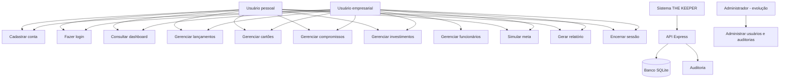
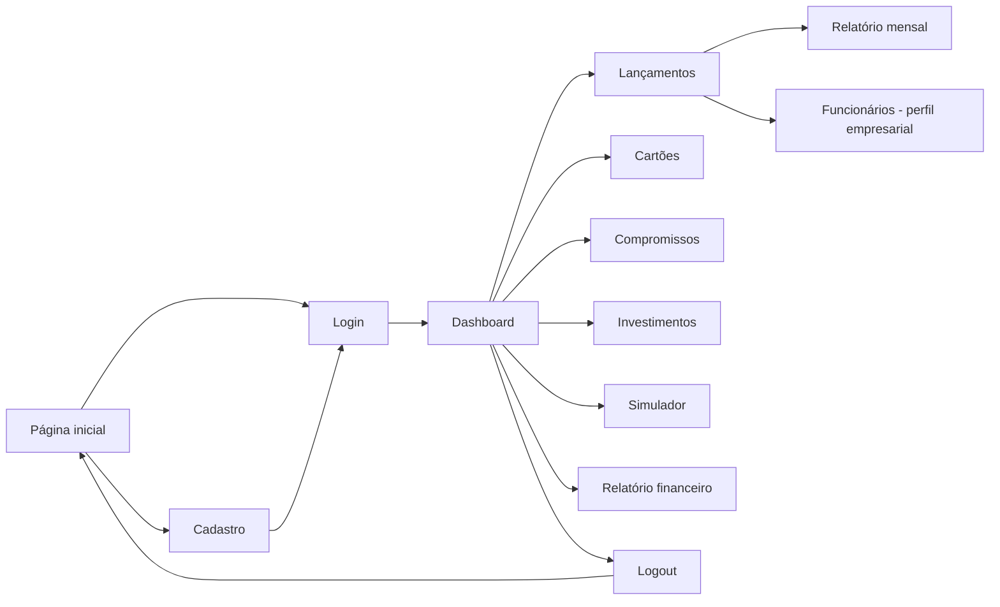
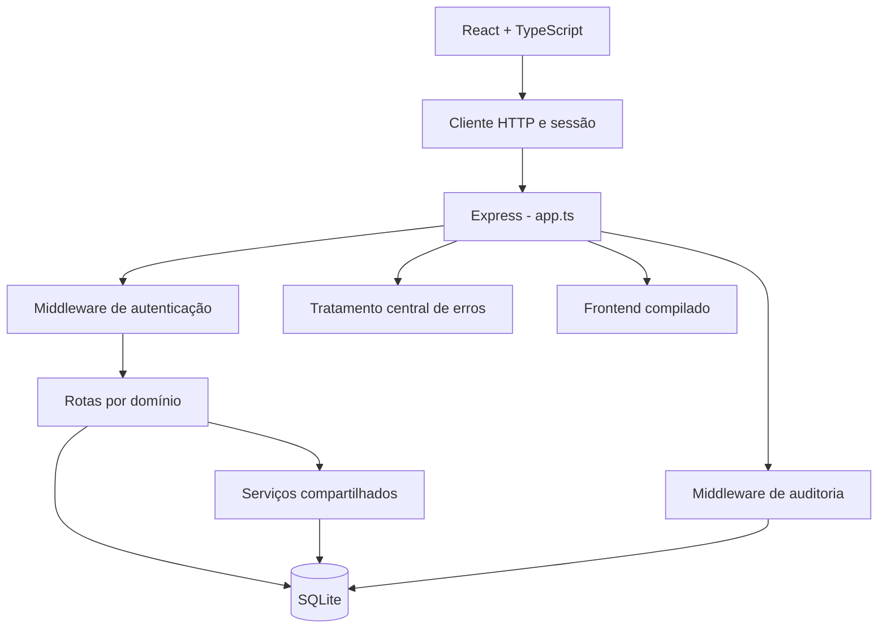

# Documentação do Projeto Web - THE KEEPER

## Sumário

1. Componentes do Projeto Web
2. Introdução
3. Visão Geral do Produto
4. Abreviações e Acrônimos
5. Envolvidos e Usuários
6. Requisitos da Aplicação Web
   - 6.1 Requisitos Funcionais
   - 6.2 Requisitos Não Funcionais
   - 6.3 Regras de Negócio
   - 6.4 Casos de Uso
7. Anexos

---

## 1. Componentes do Projeto Web

O THE KEEPER é uma aplicação web de gestão financeira pessoal e empresarial. O projeto utiliza React e TypeScript no frontend, Node.js com Express e TypeScript no backend e SQLite para persistência dos dados.

A interface é uma SPA (Single Page Application) responsiva. O frontend consome uma API REST, e o backend também pode servir a versão compilada da aplicação em produção.

### Componentes principais

| Componente | Arquivo | Responsabilidade |
|---|---|---|
| Página inicial | `frontend-novo/src/pages/Home.tsx` | Apresenta o THE KEEPER e direciona o usuário para autenticação. |
| Login e cadastro | `frontend-novo/src/pages/Login.tsx` | Permite criar uma conta pessoal ou empresarial e autenticar o usuário. |
| Dashboard | `frontend-novo/src/pages/Dashboard.tsx` | Exibe saldo, entradas, despesas, patrimônio investido, fluxo de caixa, movimentações e compromissos. |
| Lançamentos | `frontend-novo/src/pages/Lancamentos.tsx` | Registra e consulta receitas e despesas, aplica filtros e gera relatório mensal. |
| Gestão de funcionários | `frontend-novo/src/pages/Lancamentos.tsx` | Permite ao perfil empresarial cadastrar funcionários e preparar lançamentos de folha. |
| Cartões | `frontend-novo/src/pages/Cartoes.tsx` | Cadastra, edita e remove cartões, controlando limite, uso, fechamento e vencimento. |
| Compromissos | `frontend-novo/src/pages/Compromissos.tsx` | Controla contas a pagar, valores a receber, vencimentos, recorrência e status. |
| Investimentos | `frontend-novo/src/pages/Investimentos.tsx` | Registra investimentos pessoais ou reservas e aplicações empresariais. |
| Simulador | `frontend-novo/src/pages/Simulador.tsx` | Projeta metas financeiras e compara cenários conservador, base e otimista. |
| Layout autenticado | `frontend-novo/src/components/AppLayout.tsx` | Exibe menu, identificação do perfil, conteúdo protegido e opção de logout. |
| Cliente da API | `frontend-novo/src/api.ts` | Centraliza requisições HTTP, token e sessão do usuário. |
| Relatórios | `frontend-novo/src/pdfReport.ts` | Monta relatórios financeiros imprimíveis e permite salvá-los como PDF. |
| Composição da API | `backend/src/app.ts` | Configura o Express, middlewares, frontend estático e grupos de rotas. |
| Inicialização do servidor | `backend/src/server.ts` | Abre o banco, inicia o servidor HTTP e trata seu encerramento. |
| Rotas da API | `backend/src/routes/` | Separa os endpoints por domínio financeiro. |
| Autenticação | `backend/src/routes/auth.ts` | Realiza cadastro, login, geração de token e atualização de hashes legados. |
| Middlewares | `backend/src/middlewares/` | Valida autenticação, registra auditoria e padroniza erros. |
| Segurança | `backend/src/utils/security.ts` | Protege senhas com scrypt e assina os tokens de acesso. |
| Banco de dados | `backend/src/database.ts` | Abre o SQLite, cria tabelas, índices, colunas e registros iniciais. |
| Smoke test | `scripts/smoke-apresentacao.ps1` | Compila o projeto e testa os principais fluxos em um banco temporário. |

### Tecnologias utilizadas

| Tecnologia | Uso no projeto |
|---|---|
| React | Construção da interface por componentes. |
| TypeScript | Tipagem do frontend e do backend. |
| Vite | Servidor de desenvolvimento e build do frontend. |
| React Router | Navegação entre páginas públicas e protegidas. |
| CSS | Identidade visual, layout e responsividade. |
| Node.js | Ambiente de execução do backend. |
| Express | Criação da API HTTP e entrega do frontend compilado. |
| SQLite | Banco de dados relacional local do projeto. |
| Biblioteca `sqlite` | API assíncrona para acesso ao SQLite. |
| `sqlite3` | Driver utilizado para conexão com o banco. |
| Node Crypto | Hash de senha com scrypt, salt e assinatura dos tokens. |
| ESLint | Análise estática do código do frontend. |
| npm | Gerenciamento de dependências e scripts do projeto. |
| PowerShell | Automação do smoke test no Windows. |

---

## 2. Introdução

O THE KEEPER é uma aplicação web criada para centralizar o controle financeiro de pessoas e pequenos negócios. A proposta é permitir que o usuário acompanhe sua situação financeira em um único ambiente, evitando o uso de informações espalhadas entre planilhas, anotações e diferentes aplicativos.

O usuário pode criar uma conta pessoal ou empresarial, registrar receitas e despesas, acompanhar saldos, controlar cartões e compromissos, registrar investimentos e simular metas financeiras.

No perfil empresarial, a aplicação adapta textos e opções para o contexto de negócios e disponibiliza o controle de funcionários, salários e benefícios. Os dados são armazenados em SQLite e acessados por uma API autenticada.

---

## 3. Visão Geral do Produto

### Nome do produto

THE KEEPER

### Objetivo

Oferecer uma plataforma simples para organização, acompanhamento e planejamento financeiro pessoal ou empresarial, reunindo operações diárias, indicadores e projeções em uma única aplicação.

### Público-alvo

- Pessoas que desejam controlar receitas, despesas, cartões e investimentos.
- Autônomos e microempreendedores que precisam acompanhar o caixa do negócio.
- Pequenas empresas que desejam registrar movimentações, compromissos e custos de equipe.
- Usuários que desejam simular metas antes de assumir compromissos financeiros.

### Escopo implementado

- Página pública de apresentação.
- Cadastro de usuário.
- Escolha entre perfil pessoal e empresarial.
- Login com e-mail e senha.
- Sessão local com token assinado.
- Proteção das páginas e rotas financeiras.
- Dashboard financeiro.
- Fluxo de caixa mensal.
- Cadastro e consulta de contas.
- Cadastro e consulta de categorias.
- Cadastro, edição e remoção de movimentações pela API.
- Registro de receitas e despesas pela interface.
- Atualização automática do saldo das contas.
- Filtros de lançamentos por mês, tipo e texto.
- Modelos rápidos de lançamentos pessoais e empresariais.
- Cadastro, edição e remoção de cartões.
- Resumo de limite total, usado e disponível.
- Cadastro e controle de compromissos a pagar e a receber.
- Alteração de compromisso para pago ou cancelado.
- Cadastro e acompanhamento de investimentos.
- Cadastro e remoção de funcionários no perfil empresarial.
- Cálculo de salários, benefícios e custo total da equipe.
- Simulação de metas financeiras.
- Comparação entre cenários conservador, base e otimista.
- Geração de relatório financeiro e histórico mensal em PDF.
- Registro de auditoria de login e alterações.
- Smoke test automatizado dos principais fluxos.

### Fora do escopo da versão atual

- Recuperação de senha por e-mail.
- Autenticação em dois fatores.
- Integração com bancos por Open Finance.
- Importação automática de extratos.
- Sincronização automática de faturas de cartão.
- Geração automática de movimentação ao pagar um compromisso.
- Geração automática de movimentação ao registrar um investimento.
- Pagamentos reais por Pix, boleto ou cartão.
- Cotações de investimentos em tempo real.
- Emissão fiscal e integração contábil.
- Aplicativo Android ou iOS nativo.
- Painel administrativo completo.
- Deploy em nuvem com banco remoto.
- Rotação e renovação automática de tokens.

---

## 4. Abreviações e Acrônimos

| Termo | Significado |
|---|---|
| API | Interface de Programação de Aplicações. |
| REST | Estilo de arquitetura utilizado na comunicação HTTP da API. |
| CRUD | Create, Read, Update, Delete: criar, consultar, atualizar e excluir. |
| SPA | Single Page Application: aplicação web carregada em uma única página-base. |
| UI | User Interface: interface do usuário. |
| UX | User Experience: experiência do usuário. |
| RF | Requisito Funcional. |
| RNF | Requisito Não Funcional. |
| RN | Regra de Negócio. |
| HTTP | Protocolo utilizado na comunicação entre frontend e backend. |
| JSON | Formato de dados utilizado nas requisições e respostas da API. |
| SQL | Linguagem utilizada para consultar e alterar o banco de dados. |
| SQLite | Banco de dados relacional embarcado e armazenado em arquivo. |
| SGBD | Sistema Gerenciador de Banco de Dados. |
| NPM | Gerenciador de pacotes utilizado no projeto Node.js. |
| PDF | Portable Document Format: formato usado nos relatórios financeiros. |
| CORS | Mecanismo de controle de acesso entre origens web. |
| Token | Credencial assinada utilizada para identificar a sessão autenticada. |
| Bearer | Esquema HTTP utilizado para enviar o token no cabeçalho `Authorization`. |
| Hash | Resultado irreversível utilizado para proteger a senha armazenada. |
| Salt | Valor aleatório acrescentado ao processo de hash de senha. |
| scrypt | Algoritmo utilizado para derivação segura do hash das senhas. |
| WAL | Write-Ahead Logging: modo do SQLite que melhora estabilidade e concorrência. |
| MVP | Produto Mínimo Viável. |

---

## 5. Envolvidos e Usuários

| Envolvido/Usuário | Descrição | Responsabilidades/Interesses |
|---|---|---|
| Usuário pessoal | Pessoa que utiliza a aplicação para organizar suas finanças. | Registrar receitas e despesas, acompanhar saldo, cartões, compromissos, investimentos e metas. |
| Usuário empresarial | Responsável financeiro por um pequeno negócio. | Controlar caixa, despesas, compromissos, reservas, investimentos e custos de funcionários. |
| Funcionário | Pessoa registrada na folha do perfil empresarial. | Possui nome, função, salário, benefícios e situação ativa armazenados para cálculo da equipe. Não acessa diretamente o sistema. |
| Desenvolvedor | Responsável pela implementação e manutenção. | Construir frontend, backend, banco, regras, validações, testes e documentação. |
| Professor/Avaliador | Responsável pela avaliação acadêmica do projeto. | Verificar requisitos, funcionamento, organização, segurança, documentação e apresentação. |
| Administrador do sistema | Perfil técnico previsto para evolução. | Monitorar usuários, auditorias, segurança e manutenção. Não possui painel próprio na versão atual. |

---

## 6. Requisitos da Aplicação Web

### 6.1 Requisitos Funcionais

| Código | Requisito | Descrição | Status |
|---|---|---|---|
| RF01 | Cadastro de usuário | O sistema deve permitir cadastro com nome, e-mail, senha e tipo de conta. | Implementado |
| RF02 | Seleção de perfil | O cadastro deve permitir escolher entre conta pessoal e empresarial. | Implementado |
| RF03 | Login | O sistema deve autenticar o usuário por e-mail e senha. | Implementado |
| RF04 | Manutenção da sessão | O frontend deve armazenar a sessão local e enviar o token nas chamadas protegidas. | Implementado |
| RF05 | Logout | O usuário deve poder encerrar a sessão e voltar para a página inicial. | Implementado |
| RF06 | Proteção de acesso | Páginas e endpoints financeiros devem exigir autenticação. | Implementado |
| RF07 | Dashboard financeiro | O sistema deve exibir saldo, entradas, despesas, patrimônio investido e dados recentes. | Implementado |
| RF08 | Fluxo de caixa | O sistema deve consolidar entradas, saídas e resultado por mês. | Implementado |
| RF09 | Gestão de contas | A API deve permitir criar, listar, editar e remover contas financeiras. | Implementado |
| RF10 | Gestão de categorias | A API deve permitir criar, listar, editar e remover categorias. | Implementado |
| RF11 | Registro de movimentações | O sistema deve permitir registrar receitas e despesas com conta, categoria, valor, descrição e data. | Implementado |
| RF12 | Manutenção de movimentações | A API deve permitir editar e remover movimentações, corrigindo o saldo correspondente. | Implementado |
| RF13 | Consulta e filtros | A tela de lançamentos deve filtrar movimentações por mês, tipo e texto. | Implementado |
| RF14 | Modelos rápidos | A tela deve oferecer modelos de receitas e despesas conforme o perfil do usuário. | Implementado |
| RF15 | Gestão de cartões | O sistema deve cadastrar, listar, editar e remover cartões. | Implementado |
| RF16 | Resumo de cartões | O sistema deve calcular limite total, limite usado e limite disponível. | Implementado |
| RF17 | Gestão de compromissos | O sistema deve cadastrar contas a pagar e valores a receber. | Implementado |
| RF18 | Status de compromissos | O usuário deve poder marcar compromissos como pagos ou cancelados. | Implementado |
| RF19 | Gestão de investimentos | O sistema deve registrar investimentos, quantidade, preço médio e valor atual. | Implementado |
| RF20 | Resumo de investimentos | O sistema deve calcular custo, valor atual e resultado da carteira. | Implementado |
| RF21 | Gestão de funcionários | O perfil empresarial deve cadastrar e remover funcionários com salário e benefícios. | Implementado |
| RF22 | Resumo da folha | O sistema deve calcular salários, benefícios e custo total dos funcionários ativos. | Implementado |
| RF23 | Simulação de metas | O sistema deve projetar uma meta usando saldo inicial, aporte, prazo e crescimento mensal. | Implementado |
| RF24 | Comparação de cenários | O simulador deve comparar cenários conservador, base e otimista. | Implementado |
| RF25 | Relatório financeiro | O dashboard deve gerar um relatório financeiro imprimível em PDF. | Implementado |
| RF26 | Histórico mensal | A tela de lançamentos deve gerar relatório mensal das movimentações. | Implementado |
| RF27 | Auditoria | O backend deve registrar login e alterações bem-sucedidas em rotas protegidas. | Implementado |
| RF28 | Recuperação de senha | O sistema deve permitir redefinir a senha por e-mail. | Não implementado |
| RF29 | Integração bancária | O sistema deve importar dados automaticamente de instituições financeiras. | Não implementado |
| RF30 | Fatura automática | O sistema deve gerar faturas de cartão e integrá-las às movimentações. | Não implementado |

### 6.2 Requisitos Não Funcionais

| Código | Requisito | Descrição | Status |
|---|---|---|---|
| RNF01 | Persistência de dados | O sistema deve armazenar os dados em banco SQLite. | Implementado |
| RNF02 | Proteção de senha | As senhas não devem ser armazenadas em texto puro. | Implementado |
| RNF03 | Autenticação por token | As rotas financeiras devem exigir token assinado. | Implementado |
| RNF04 | Isolamento de usuário | O backend deve utilizar o usuário do token para restringir o acesso aos dados. | Implementado |
| RNF05 | Integridade referencial | O banco deve utilizar chaves estrangeiras entre usuários e dados financeiros. | Implementado |
| RNF06 | Consistência financeira | Alterações de movimentação e saldo devem ocorrer em transações. | Implementado |
| RNF07 | Rastreabilidade | Operações de escrita bem-sucedidas devem ser registradas em auditoria. | Implementado |
| RNF08 | Responsividade | A interface deve se adaptar a diferentes tamanhos de tela. | Implementado |
| RNF09 | Usabilidade | A interface deve apresentar navegação clara, resumos e mensagens de retorno. | Implementado |
| RNF10 | Validação de entrada | O sistema deve rejeitar dados obrigatórios ausentes ou inválidos. | Implementado |
| RNF11 | Tratamento de erros | A API deve retornar erros JSON com código HTTP e mensagem padronizada. | Implementado |
| RNF12 | Desempenho local | As consultas mais frequentes devem utilizar índices no SQLite. | Implementado |
| RNF13 | Compatibilidade | O frontend deve funcionar em navegadores modernos com JavaScript habilitado. | Implementado |
| RNF14 | Manutenibilidade | O backend deve ser separado por rotas, middlewares, serviços, tipos e utilitários. | Implementado |
| RNF15 | Testabilidade | O projeto deve possuir verificação de build, lint e smoke test automatizado. | Implementado |
| RNF16 | Disponibilidade remota | A aplicação deve estar publicada em infraestrutura de nuvem. | Não implementado |
| RNF17 | Comunicação segura | A aplicação publicada deve utilizar HTTPS. | Não implementado |
| RNF18 | Backup automático | O banco deve possuir rotina automática e externa de backup. | Não implementado |
| RNF19 | Acessibilidade completa | A interface deve passar por auditoria formal de acessibilidade WCAG. | Implementado parcialmente |

### 6.3 Regras de Negócio

#### [RN001] Cadastro único por e-mail

O sistema não permite dois usuários com o mesmo e-mail. A coluna `email` da tabela `usuarios` possui restrição `UNIQUE`, e a API retorna conflito quando o endereço já está cadastrado.

#### [RN002] Senha mínima

O cadastro exige senha com pelo menos seis caracteres. A senha é processada com scrypt e salt aleatório antes de ser armazenada.

#### [RN003] Criação de registros padrão

Ao cadastrar um usuário, o sistema cria automaticamente:

- uma conta chamada `Principal`;
- uma categoria chamada `Geral`.

#### [RN004] Acesso autenticado

O usuário precisa estar autenticado para acessar as páginas internas e as rotas financeiras da API. O token é enviado no cabeçalho:

```http
Authorization: Bearer <token>
```

#### [RN005] Prioridade do usuário autenticado

Nas rotas protegidas, o identificador contido no token tem prioridade sobre qualquer `usuario_id` enviado pelo frontend. Essa regra reduz o risco de acesso a dados de outro usuário por alteração manual da requisição.

#### [RN006] Validade da sessão

O token assinado pelo backend possui validade de oito horas. Tokens ausentes, alterados ou expirados são rejeitados.

#### [RN007] Sinal da movimentação

- Receitas são armazenadas com valor positivo.
- Despesas são armazenadas com valor negativo.
- Movimentações com valor igual a zero não são aceitas.

#### [RN008] Atualização do saldo

Ao criar uma movimentação, o valor é aplicado ao saldo da conta. Ao editar ou excluir, o backend desfaz o impacto anterior e aplica o novo resultado.

#### [RN009] Transação financeira

O registro da movimentação e a alteração do saldo devem ocorrer na mesma transação SQLite. Em caso de erro, as alterações são desfeitas.

#### [RN010] Conta pertencente ao usuário

Uma movimentação só pode utilizar uma conta pertencente ao usuário autenticado. Se nenhuma conta for informada, o sistema usa a primeira conta do usuário ou cria a conta `Principal`.

#### [RN011] Categoria pertencente ao usuário

Uma movimentação só pode utilizar uma categoria pertencente ao usuário autenticado. Se nenhuma categoria for informada, o sistema usa ou cria a categoria `Geral`.

#### [RN012] Exclusão de conta em uso

Uma conta que possui movimentações não pode ser removida, preservando a integridade do histórico financeiro.

#### [RN013] Exclusão de categoria em uso

Uma categoria que possui movimentações não pode ser removida.

#### [RN014] Limite usado do cartão

O limite usado não pode ser armazenado acima do limite total informado. Quando necessário, o backend limita o valor usado ao limite total.

#### [RN015] Dias do cartão

Os dias de fechamento e vencimento devem estar entre 1 e 31. Valores inválidos são substituídos pelos padrões definidos pelo sistema.

#### [RN016] Compromissos não alteram saldo

Compromissos funcionam como agenda e previsão financeira. Criar, pagar, cancelar ou remover um compromisso não gera movimentação automática.

#### [RN017] Status de compromisso

Um compromisso pode estar:

- `aberto`;
- `pago`;
- `cancelado`.

Compromissos abertos e vencidos recebem destaque visual na interface.

#### [RN018] Investimentos não alteram saldo

Os investimentos compõem o patrimônio apresentado no dashboard, mas não retiram nem adicionam valores automaticamente às contas.

#### [RN019] Cálculo do investimento

O custo de um investimento é calculado por:

```text
custo = quantidade × preço médio
resultado = valor atual - custo
```

#### [RN020] Perfil pessoal e empresarial

O tipo de conta altera textos, modelos de lançamento, opções de investimento e recursos de equipe. O controle de funcionários é disponibilizado na experiência empresarial.

#### [RN021] Custo da equipe

O resumo da equipe considera apenas funcionários ativos:

```text
custo total = salários + benefícios
```

#### [RN022] Simulação sem alteração dos dados

O simulador realiza projeções somente no navegador. Os valores simulados não criam movimentações nem alteram o banco.

#### [RN023] Geração de PDF

Os relatórios são montados no navegador e enviados para a função de impressão. O usuário pode selecionar a opção de salvar como PDF.

#### [RN024] Auditoria de alterações

Operações `POST`, `PUT` e `DELETE` concluídas com sucesso em rotas protegidas são registradas na tabela `auditoria`.

---

### 6.4 Casos de Uso

### Atores

- Usuário pessoal.
- Usuário empresarial.
- Sistema THE KEEPER.
- Administrador, como ator previsto para evolução.

### Diagrama textual de casos de uso



### UC01 - Cadastrar conta

| Campo | Descrição |
|---|---|
| Ator principal | Usuário pessoal ou empresarial |
| Pré-condição | O e-mail informado ainda não está cadastrado. |
| Fluxo principal | O usuário acessa a autenticação, seleciona cadastro, informa tipo de conta, nome, e-mail, senha e confirmação. O frontend envia os dados e o backend cria usuário, conta Principal e categoria Geral. |
| Fluxo alternativo | Se os campos estiverem inválidos, as senhas forem diferentes ou o e-mail já existir, o sistema exibe uma mensagem de erro. |
| Pós-condição | Conta criada e pronta para autenticação. |

### UC02 - Fazer login

| Campo | Descrição |
|---|---|
| Ator principal | Usuário pessoal ou empresarial |
| Pré-condição | O usuário possui cadastro. |
| Fluxo principal | O usuário informa e-mail e senha. O backend verifica o hash, registra a auditoria e devolve um token assinado. |
| Fluxo alternativo | Se as credenciais forem inválidas, o acesso é negado. |
| Pós-condição | Sessão armazenada no navegador e usuário redirecionado ao dashboard. |

### UC03 - Registrar movimentação

| Campo | Descrição |
|---|---|
| Ator principal | Usuário autenticado |
| Pré-condição | O usuário possui sessão válida, conta e categoria disponíveis. |
| Fluxo principal | O usuário acessa Lançamentos, escolhe receita ou despesa, informa descrição, valor, data, conta e categoria e confirma o registro. |
| Fluxo alternativo | Se o valor for inválido ou algum dado obrigatório estiver ausente, a API rejeita a operação. |
| Pós-condição | Movimentação registrada e saldo da conta atualizado. |

### UC04 - Gerenciar cartão

| Campo | Descrição |
|---|---|
| Ator principal | Usuário autenticado |
| Pré-condição | O usuário possui sessão válida. |
| Fluxo principal | O usuário informa nome, bandeira, limites, fechamento, vencimento e estado do cartão e confirma o cadastro. |
| Fluxo alternativo | O usuário pode editar ou remover um cartão existente. Dados financeiros inválidos são rejeitados. |
| Pós-condição | Cartão salvo e resumo de limites recalculado. |

### UC05 - Gerenciar compromisso

| Campo | Descrição |
|---|---|
| Ator principal | Usuário autenticado |
| Pré-condição | O usuário possui sessão válida. |
| Fluxo principal | O usuário cadastra uma conta a pagar ou valor a receber, informando descrição, valor, vencimento e recorrência. |
| Fluxo alternativo | O usuário pode marcar o compromisso como pago, cancelado ou removê-lo. |
| Pós-condição | Agenda financeira e saldo previsto atualizados na interface. O saldo real não é alterado. |

### UC06 - Gerenciar investimento

| Campo | Descrição |
|---|---|
| Ator principal | Usuário autenticado |
| Pré-condição | O usuário possui sessão válida. |
| Fluxo principal | O usuário informa nome, tipo, instituição, quantidade, preço médio e valor atual do investimento. |
| Fluxo alternativo | Se os números forem inválidos, o cadastro é rejeitado. |
| Pós-condição | Investimento registrado e patrimônio consolidado atualizado. |

### UC07 - Gerenciar funcionários

| Campo | Descrição |
|---|---|
| Ator principal | Usuário empresarial |
| Pré-condição | O usuário está autenticado com perfil empresarial. |
| Fluxo principal | O usuário abre a área de funcionários, informa nome, função, salário e benefícios e salva o registro. |
| Fluxo alternativo | O usuário pode remover um funcionário ou cancelar o cadastro. |
| Pós-condição | Equipe registrada e custo da folha recalculado. |

### UC08 - Simular meta financeira

| Campo | Descrição |
|---|---|
| Ator principal | Usuário autenticado |
| Pré-condição | O usuário acessou a página do simulador. |
| Fluxo principal | O usuário informa objetivo, meta, saldo inicial, aporte mensal, crescimento e prazo. O sistema calcula a projeção. |
| Fluxo alternativo | O usuário pode usar o saldo atual do dashboard e comparar diferentes cenários. |
| Pós-condição | Projeção, rendimento, progresso e aporte necessário são apresentados sem alterar o banco. |

### UC09 - Gerar relatório

| Campo | Descrição |
|---|---|
| Ator principal | Usuário autenticado |
| Pré-condição | O navegador permite abertura da janela de relatório. |
| Fluxo principal | O usuário solicita o relatório no dashboard ou na página de lançamentos. O sistema monta o documento e abre a impressão. |
| Fluxo alternativo | Se pop-ups estiverem bloqueados, o sistema orienta o usuário a permiti-los. |
| Pós-condição | Relatório disponível para impressão ou salvamento em PDF. |

### UC10 - Encerrar sessão

| Campo | Descrição |
|---|---|
| Ator principal | Usuário autenticado |
| Pré-condição | Existe uma sessão local ativa. |
| Fluxo principal | O usuário seleciona `Sair`; o frontend remove os dados locais e retorna à página inicial. |
| Pós-condição | Sessão local encerrada e páginas internas novamente protegidas. |

### Fluxo principal da aplicação



### Arquitetura simplificada



---

## 7. Anexos

### Link do GitHub

Repositório do projeto: <https://github.com/Heritu/TheKeeper.git>

### Link do vídeo de apresentação

Vídeo de apresentação: `[INSERIR LINK DO VÍDEO, CASO DESEJADO]`

### Telas da aplicação

> Observação: as imagens podem ser adicionadas futuramente em `docs/anexos`. Os nomes abaixo são sugestões para padronização.

| Tela | Imagem sugerida | Descrição |
|---|---|---|
| Página inicial | `docs/anexos/01_pagina_inicial.png` | Apresentação do THE KEEPER e acesso à autenticação. |
| Login | `docs/anexos/02_login.png` | Formulário de e-mail e senha. |
| Cadastro pessoal | `docs/anexos/03_cadastro_pessoal.png` | Criação de conta para gestão financeira pessoal. |
| Cadastro empresarial | `docs/anexos/04_cadastro_empresarial.png` | Criação de conta voltada à gestão de negócios. |
| Dashboard pessoal | `docs/anexos/05_dashboard_pessoal.png` | Indicadores de saldo, entradas, despesas, patrimônio e fluxo de caixa. |
| Dashboard empresarial | `docs/anexos/06_dashboard_empresarial.png` | Visão financeira adaptada ao contexto de negócio. |
| Lançamentos | `docs/anexos/07_lancamentos.png` | Registro, modelos rápidos, filtros e histórico financeiro. |
| Funcionários | `docs/anexos/08_funcionarios.png` | Cadastro de equipe, salários e benefícios no perfil empresarial. |
| Cartões | `docs/anexos/09_cartoes.png` | Cadastro de cartões e resumo dos limites. |
| Compromissos | `docs/anexos/10_compromissos.png` | Contas a pagar, valores a receber e estados dos compromissos. |
| Investimentos | `docs/anexos/11_investimentos.png` | Carteira, custo total, valor atual e distribuição. |
| Simulador | `docs/anexos/12_simulador.png` | Projeção de meta e comparação de cenários. |
| Relatório financeiro | `docs/anexos/13_relatorio_financeiro.png` | Documento gerado a partir dos dados do dashboard. |
| Histórico mensal | `docs/anexos/14_historico_mensal.png` | Relatório das movimentações do mês selecionado. |

### Documentos auxiliares

- `docs/ARQUITETURA_BACKEND.md`: organização técnica do backend.
- `docs/API.md`: referência resumida dos endpoints.
- `docs/ESTUDO_DO_PROJETO.md`: guia técnico do projeto.
- `docs/PERGUNTAS_APRESENTACAO.md`: perguntas e respostas da apresentação.
- `backend/src/database.ts`: estrutura e inicialização do banco.
- `backend/src/app.ts`: composição do servidor Express.
- `backend/src/routes/`: regras e endpoints separados por domínio.
- `frontend-novo/src/api.ts`: integração do frontend com a API.
- `scripts/smoke-apresentacao.ps1`: validação automatizada do projeto.

### Estrutura do banco de dados

| Tabela | Campos principais | Finalidade |
|---|---|---|
| `usuarios` | `id`, `nome`, `email`, `senha`, `tipo_conta`, `criado_em` | Armazena usuários com e-mail único, perfil e senha protegida. |
| `contas` | `id`, `usuario_id`, `nome_conta`, `tipo`, `instituicao`, `saldo_atual` | Armazena contas financeiras e seus saldos. |
| `categorias` | `id`, `usuario_id`, `nome`, `tipo` | Classifica receitas, despesas ou ambos. |
| `movimentacoes` | `id`, `usuario_id`, `conta_id`, `categoria_id`, `valor`, `descricao`, `data_movimentacao` | Armazena receitas e despesas e relaciona conta e categoria. |
| `cartoes` | `id`, `usuario_id`, `nome`, `bandeira`, `limite_total`, `limite_usado`, `fechamento`, `vencimento`, `ativo` | Controla cartões e utilização de limite. |
| `compromissos` | `id`, `usuario_id`, `tipo`, `descricao`, `valor`, `vencimento`, `status`, `recorrente` | Armazena contas a pagar e valores a receber. |
| `investimentos` | `id`, `usuario_id`, `nome`, `tipo`, `instituicao`, `quantidade`, `preco_medio`, `valor_atual` | Armazena investimentos e aplicações. |
| `funcionarios` | `id`, `usuario_id`, `nome`, `funcao`, `salario`, `beneficios`, `ativo` | Armazena a equipe do perfil empresarial. |
| `auditoria` | `id`, `usuario_id`, `acao`, `entidade`, `metodo`, `rota`, `ip`, `detalhes`, `criado_em` | Registra login e alterações realizadas na API. |

### Rotas principais da API

Base local:

```text
http://localhost:3000/api
```

| Grupo | Endpoints |
|---|---|
| Saúde | `GET /api/health` |
| Autenticação | `POST /api/auth/register`, `POST /api/auth/login` |
| Contas | `GET`, `POST`, `PUT`, `DELETE /api/contas` |
| Categorias | `GET`, `POST`, `PUT`, `DELETE /api/categorias` |
| Movimentações | `GET`, `POST`, `PUT`, `DELETE /api/movimentacoes` |
| Cartões | `GET`, `POST`, `PUT`, `DELETE /api/cartoes` |
| Compromissos | `GET`, `POST`, `PUT`, `DELETE /api/compromissos` |
| Investimentos | `GET`, `POST`, `PUT`, `DELETE /api/investimentos` |
| Funcionários | `GET`, `POST`, `PUT`, `DELETE /api/funcionarios` |
| Dashboard | `GET /api/dashboard` |
| Fluxo de caixa | `GET /api/fluxo-caixa` |

### Estrutura de diretórios

```text
TheKeeper/
├── backend/
│   ├── src/
│   │   ├── app.ts
│   │   ├── server.ts
│   │   ├── database.ts
│   │   ├── middlewares/
│   │   ├── routes/
│   │   ├── services/
│   │   ├── utils/
│   │   └── types.ts
│   └── package.json
├── frontend-novo/
│   ├── src/
│   │   ├── components/
│   │   ├── pages/
│   │   ├── api.ts
│   │   ├── App.tsx
│   │   ├── pdfReport.ts
│   │   └── types.ts
│   └── package.json
├── docs/
├── scripts/
├── package.json
└── rodar-apresentacao.bat
```

> O diretório `frontend/` contém uma interface anterior e não é utilizado pela versão atual.

### Requisitos para execução

- Node.js 20 ou superior.
- npm.
- Navegador web moderno.
- PowerShell para execução do smoke test no Windows.

### Instalação

```bash
npm --prefix backend install
npm --prefix frontend-novo install
```

### Execução em desenvolvimento

Utilize dois terminais.

Backend:

```bash
npm run dev:backend
```

Frontend:

```bash
npm run dev:frontend
```

### Build e execução de produção

```bash
npm run build
npm start
```

Após o build, a aplicação fica disponível por padrão em:

```text
http://localhost:3000
```

No Windows, também é possível executar:

```text
rodar-apresentacao.bat
```

### Validação do projeto

```bash
npm run check
npm run smoke
```

- `npm run check`: compila backend e frontend e executa o lint.
- `npm run smoke`: cria um banco temporário, inicia o servidor e testa autenticação, autorização e os principais recursos financeiros.

### Variáveis de ambiente

| Variável | Uso | Valor padrão |
|---|---|---|
| `PORT` | Porta utilizada pelo backend. | `3000` |
| `KEEPER_DB_PATH` | Caminho do arquivo SQLite. | `backend/database.sqlite` |
| `KEEPER_TOKEN_SECRET` | Segredo utilizado para assinar os tokens. | Valor local derivado do caminho do projeto |
| `VITE_API_URL` | URL da API utilizada pelo frontend em desenvolvimento. | Mesmo host da aplicação |

> Em ambiente de produção, `KEEPER_TOKEN_SECRET` deve receber um valor forte, aleatório e privado.
